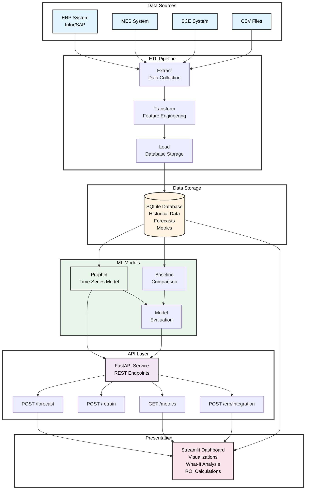
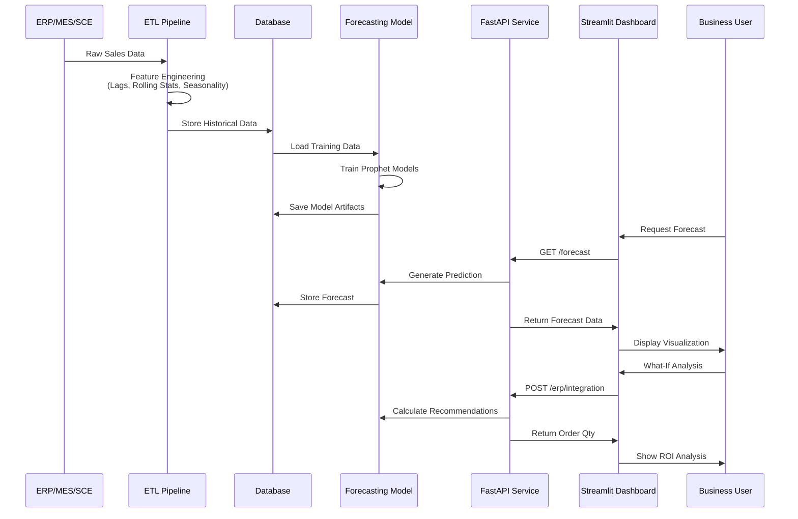
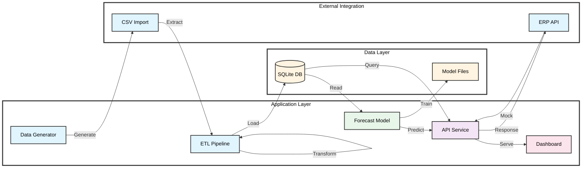

# HVAC Supply Chain Demand Forecasting Engine

[](https://www.python.org/)
[](https://fastapi.tiangolo.com/)
[](https://streamlit.io/)
[](https://facebook.github.io/prophet/)
[](https://www.sqlite.org/)
[](https://pandas.pydata.org/)
[](https://scikit-learn.org/)
[](LICENSE)

**AI Powered Demand Forecasting for HVAC Supply Chain Operations**

An end to end machine learning solution for predicting demand, optimizing inventory, and reducing supply chain costs through automated forecasting and intelligent order recommendations.

---

## Architecture

### System Architecture



### Data Flow Diagram



### Component Architecture



---

## 📋 Table of Contents

- [Project Description](#project-description)
- [Project Objectives](#project-objectives)
- [Project Solution](#project-solution)
- [Architecture](#architecture)
- [Tools and Technologies](#tools-and-technologies)
- [Installation & Setup](#installation--setup)
- [Configuration](#configuration)
- [Cost Tracking](#cost-tracking)
- [Monitoring & Observability](#monitoring--observability)
- [Technical Highlights](#technical-highlights)
- [Project Structure](#project-structure)
- [Usage Examples](#usage-examples)
- [Conclusion](#conclusion)

---

## Project Description

The HVAC Supply Chain Demand Forecasting Engine is a comprehensive machine learning system designed to predict product demand across multiple product categories and regions. The system integrates with enterprise systems (ERP, MES, SCE) to provide real time demand forecasts, inventory optimization recommendations, and ROI analysis.

The solution addresses critical supply chain challenges:
- **Demand Uncertainty**: Predicts future demand with confidence intervals
- **Inventory Optimization**: Calculates optimal reorder points and safety stock levels
- **Cost Reduction**: Minimizes holding costs while preventing stockouts
- **Operational Efficiency**: Automates forecasting and provides actionable insights

---

## Project Objectives

### Primary Objectives

1. **Accurate Demand Forecasting**
   - Predict demand 30 to 90 days in advance
   - Achieve MAPE (Mean Absolute Percentage Error) < 15%
   - Provide confidence intervals for risk assessment

2. **Inventory Optimization**
   - Calculate optimal reorder points
   - Determine safety stock levels
   - Minimize total inventory costs

3. **Enterprise Integration**
   - Connect with ERP, MES, and SCE systems
   - Provide RESTful API for system integration
   - Support real time data ingestion

4. **Business Intelligence**
   - Interactive dashboards for stakeholders
   - What if scenario analysis
   - ROI calculations and cost tracking

5. **Operational Excellence**
   - Automated model retraining
   - Performance monitoring and alerting
   - Comprehensive logging and metrics

---

## Project Solution

### Solution Overview

The system implements a complete ML pipeline from data ingestion to business insights:

1. **Data Pipeline**: ETL processes extract data from multiple sources, engineer features, and load into a centralized database
2. **Forecasting Models**: Prophet based time series models trained per product region combination
3. **API Layer**: RESTful API exposing forecast endpoints and ERP integration
4. **Dashboard**: Interactive Streamlit application for visualization and analysis
5. **Monitoring**: Model performance tracking and automated retraining

### Key Features

- **Multi Product Forecasting**: Separate models for each product region combination
- **Seasonality Handling**: Automatic detection of yearly, weekly, and monthly patterns
- **Confidence Intervals**: Upper and lower bounds for uncertainty quantification
- **Baseline Comparison**: Naive forecast comparison for model validation
- **Feature Engineering**: 15+ engineered features including lags, rolling statistics, and seasonal indicators
- **What If Analysis**: Scenario planning with ROI calculations
- **ERP Integration**: Mock endpoint demonstrating enterprise system connectivity

---

## Tools and Technologies

### Core Technologies

|       Category      |  Technology   |               Purpose                 |
|---------------------|---------------|---------------------------------------|
| **Language**        | Python 3.8+   | Core development language             |
| **ML Framework**    | Prophet       | Time series forecasting               |
| **ML Library**      | scikit-learn  | Model evaluation metrics              |
| **Data Processing** | pandas, numpy | Data manipulation and analysis        |
| **API Framework**   | FastAPI       | RESTful API development               |
| **Dashboard**       | Streamlit     | Interactive web dashboard             |
| **Visualization**   | Plotly        | Interactive charts and graphs         |
| **Database**        | SQLite        | Data storage (production: PostgreSQL) |
| **ORM**             | SQLAlchemy    | Database abstraction layer            |

### Development Tools

- **Version Control**: Git
- **Package Management**: pip, requirements.txt
- **Configuration**: YAML (config.yaml)
- **Documentation**: Markdown, Swagger/OpenAPI

### Deployment & Infrastructure

- **Containerization**: Docker ready (structure supports containerization)
- **Cloud Platforms**: Designed for Azure ML, AWS SageMaker, GCP AI Platform
- **API Documentation**: Auto generated Swagger UI
- **Monitoring**: Custom metrics tracking and logging

---

## Installation & Setup

### Prerequisites

- Python 3.8 or higher
- pip package manager
- 4GB+ RAM recommended
- 2GB+ disk space for data and models

### Complete Setup (First Time)

1. **Clone the repository**
   ```bash
   git clone <repository-url>
   cd "Supply Chain Demand Forecasting Engine"
   ```

2. **Create virtual environment**
   ```bash
   python -m venv venv
   source venv/bin/activate  # On Windows: venv\Scripts\activate
   ```

3. **Install dependencies**
   ```bash
   pip install -r requirements.txt
   ```

4. **Create folder structure**
   ```bash
   mkdir -p data/raw data/processed models
   ```

5. **Run the complete pipeline**
   ```bash
   python run_pipeline.py
   ```
   
   This will:
   - Generate sample HVAC sales data (if not present)
   - Run ETL pipeline with feature engineering
   - Train Prophet forecasting models
   - Evaluate model performance

### Starting the Services

**FastAPI Server:**
```bash
python -m uvicorn api:app --reload --host 0.0.0.0 --port 8000
```
- API: `http://localhost:8000`
- Docs: `http://localhost:8000/docs`
- Health: `http://localhost:8000/health`

**Streamlit Dashboard:**
```bash
streamlit run dashboard.py
```
- Dashboard: `http://localhost:8501`

---

## Configuration

Configuration is managed through `config.yaml`:

```yaml
database:
  path: "data/forecast_db.sqlite"
  
model:
  name: "prophet_forecast_model"
  forecast_periods: 90  # days
  seasonality_mode: "multiplicative"
  yearly_seasonality: true
  weekly_seasonality: true
  daily_seasonality: false
  
etl:
  data_path: "data/raw"
  processed_path: "data/processed"
  
api:
  host: "0.0.0.0"
  port: 8000
  
dashboard:
  port: 8501
```

### Configuration Options

- **Database Path**: Location of SQLite database file
- **Forecast Periods**: Number of days to forecast ahead
- **Seasonality Mode**: Multiplicative or additive seasonality
- **API/Dashboard Ports**: Service ports for API and dashboard

### Environment Variables

For production deployments, consider using environment variables:
- `DATABASE_URL`: Database connection string
- `API_HOST`: API server host
- `API_PORT`: API server port
- `LOG_LEVEL`: Logging level (DEBUG, INFO, WARNING, ERROR)

---

## Cost Tracking

### Cost Metrics Tracked

The system tracks and calculates various cost metrics to measure ROI:

#### 1. Inventory Holding Costs
- **Formula**: `Excess Inventory × Unit Cost × Holding Cost % × Time Period`
- **Default Holding Cost**: 25% annually
- **Calculation**: Tracks excess inventory above optimal levels

#### 2. Stockout Risk Costs
- **Formula**: `Potential Stockouts × Stockout Cost per Event`
- **Default Stockout Cost**: $1,000 per event
- **Calculation**: Estimates cost of inventory shortages

#### 3. Order Optimization Savings
- **Formula**: `(Current Order Qty - Optimal Order Qty) × Unit Cost`
- **Calculation**: Savings from ordering optimal quantities

#### 4. Service Level Impact
- **Metric**: Target service level vs. actual
- **Cost Impact**: Calculates cost of service level improvements

### Cost Tracking Implementation

Cost metrics are calculated in the dashboard's "What If Analysis" page and can be accessed via:

- **Dashboard**: Interactive ROI calculations with visualizations
- **API Endpoint**: `/erp/integration` returns cost optimized order recommendations
- **Database**: Historical cost data stored in metrics tables

### Example Cost Calculation

```python
# Holding Cost Calculation
excess_inventory = max(0, current_inventory - reorder_point)
holding_cost = excess_inventory * unit_cost * (holding_cost_pct / 365) * lead_time_days

# Stockout Risk Calculation
potential_stockouts = max(0, reorder_point - current_inventory) / avg_daily_demand
stockout_cost = potential_stockouts * stockout_cost_per_event

# Total Cost
total_cost = holding_cost + stockout_cost
```

---

## Monitoring & Observability

### Model Performance Monitoring

The system tracks multiple metrics to monitor model health:

#### 1. Forecast Accuracy Metrics
- **MAPE** (Mean Absolute Percentage Error): Percentage based error metric
- **RMSE** (Root Mean Squared Error): Scale dependent error metric
- **MASE** (Mean Absolute Scaled Error): Scale independent error metric
- **Baseline Comparison**: Performance vs. naive forecast

#### 2. Model Health Indicators
- **Training Status**: Success/failure of model training
- **Model Version**: Version tracking for model artifacts
- **Last Training Date**: Timestamp of last model update
- **Data Quality**: Number of training samples, data completeness

#### 3. System Health Monitoring
- **API Health**: `/health` endpoint for service status
- **Database Connectivity**: Connection status and query performance
- **Model Availability**: Model loading and prediction latency

### Observability Features

#### Logging
- **Application Logs**: Structured logging for all operations
- **Error Tracking**: Exception logging with stack traces
- **Performance Logs**: Request latency and processing times

#### Metrics Storage
- **Database Tables**: 
  - `model_metrics`: Performance metrics per model version
  - `model_training_history`: Training event logs
  - `forecasts`: Historical forecast predictions

#### Dashboard Monitoring
- **Model Performance Page**: Visual display of accuracy metrics
- **Training History**: Timeline of model updates
- **Forecast Tracking**: Historical forecast accuracy

### Alerting (Future Enhancement)

Planned alerting capabilities:
- Model accuracy degradation alerts
- Training failure notifications
- Data quality issues warnings
- API performance degradation alerts

---

## Technical Highlights

### 1. Advanced Feature Engineering

The ETL pipeline creates 15+ engineered features:

- **Temporal Features**: Year, month, day of year, week, day of week, quarter
- **Lag Features**: 1 day, 7 day, 30 day demand lags
- **Rolling Statistics**: 7, 30, 90 day moving averages and standard deviations
- **Seasonal Indicators**: Summer/winter flags, weekend indicators
- **Growth Metrics**: Week over week, month over month growth rates

### 2. Prophet Model Configuration

- **Multiplicative Seasonality**: Handles varying seasonal amplitudes
- **Custom Seasonalities**: Monthly and quarterly patterns
- **Changepoint Detection**: Automatic trend change detection
- **Uncertainty Intervals**: Confidence bounds for predictions

### 3. Scalable Architecture

- **Modular Design**: Components can be replaced independently
- **Database Abstraction**: Easy migration from SQLite to PostgreSQL/MySQL
- **Stateless API**: Horizontal scaling support
- **Background Tasks**: Async model retraining

### 4. Enterprise Integration Patterns

- **RESTful API**: Standard HTTP methods and status codes
- **ERP Integration**: Mock endpoint demonstrating enterprise connectivity
- **Data Validation**: Pydantic models for request/response validation
- **Error Handling**: Comprehensive error responses

### 5. Business Intelligence Features

- **Interactive Dashboards**: Real time data visualization
- **What-If Analysis**: Scenario planning with ROI calculations
- **Export Capabilities**: Data export for further analysis
- **Multi-Product Support**: Forecasts for multiple product region combinations

### 6. Production Ready Features

- **Model Versioning**: Track model versions and performance
- **Database Transactions**: ACID compliance for data integrity
- **API Documentation**: Auto generated Swagger/OpenAPI docs
- **Health Checks**: Service health monitoring endpoints
- **Error Recovery**: Graceful error handling and recovery

---

## Project Structure

```
Supply Chain Demand Forecasting Engine/
│
├── src/
│   ├── __init__.py              # Package marker
│   ├── data_generator.py        # Generate synthetic HVAC data
│   ├── database.py              # SQLite database operations
│   ├── etl_pipeline.py          # ETL: Extract, Transform, Load
│   └── forecast_model.py        # Prophet ML models
│
├── data/
│   ├── raw/
│   │   └── hvac_sales_raw.csv   # Generated by data_generator.py
│   ├── processed/               # (optional, currently unused)
│   └── forecast_db.sqlite       # Generated by ETL pipeline
│
├── models/
│   └── prophet_model.pkl        # Generated by forecast_model.py
│
├── api.py                       # FastAPI REST API (ROOT LEVEL)
├── dashboard.py                 # Streamlit dashboard (ROOT LEVEL)
├── run_pipeline.py              # Main pipeline runner
├── config.yaml                  # Configuration file
├── requirements.txt             # Python dependencies
├── setup.py                     # Package installation
├── .gitignore                   # Git ignore rules
└── README.md                    # Project documentation
```

---

## Usage Examples

### API Usage

**Get Forecast:**
```bash
curl -X POST "http://localhost:8000/forecast" \
  -H "Content-Type: application/json" \
  -d '{
    "product_category": "AC_Unit_Residential",
    "region": "North",
    "periods": 90
  }'
```

**Retrain Model:**
```bash
curl -X POST "http://localhost:8000/retrain"
```

**Get Model Metrics:**
```bash
curl "http://localhost:8000/metrics"
```

**ERP Integration:**
```bash
curl -X POST "http://localhost:8000/erp/integration" \
  -H "Content-Type: application/json" \
  -d '{
    "product_sku": "AC-RES-001",
    "region_code": "N",
    "current_inventory": 500,
    "lead_time_days": 30
  }'
```

### Dashboard Usage

1. **Overview**: View key metrics, total demand, revenue, and trends
2. **Historical Data**: Explore past demand patterns with filtering
3. **Forecasts**: Generate and visualize demand forecasts with confidence intervals
4. **Model Performance**: Review accuracy metrics (MAPE, RMSE, MASE)
5. **What If Analysis**: Run scenario planning with ROI calculations
6. **ERP Integration**: Test ERP integration endpoints with mock data

### Python API Usage

```python
from src.database import ForecastDatabase
from src.forecast_model import DemandForecastModel

# Load database
db = ForecastDatabase()

# Load historical data
df = db.load_historical_data(
    product_category="AC_Unit_Residential",
    region="North"
)

# Load model
model = DemandForecastModel()
model.load_model('models/prophet_model.pkl')

# Generate forecast
forecast = model.predict(
    product_category="AC_Unit_Residential",
    region="North",
    periods=90
)

print(forecast.head())
```

---

## Conclusion

The Supply Chain Demand Forecasting Engine provides a complete, production ready solution for demand forecasting and inventory optimization. The system demonstrates:

- **End to End ML Pipeline**: From data ingestion to business insights
- **Enterprise Integration**: Ready for ERP, MES, and SCE system connectivity
- **Scalable Architecture**: Designed for cloud deployment and horizontal scaling
- **Business Value**: ROI calculations and cost optimization recommendations
- **Operational Excellence**: Monitoring, logging, and automated retraining

### Key Achievements

✅ Accurate demand forecasting with confidence intervals  
✅ Inventory optimization with cost tracking  
✅ Enterprise ready API and integration patterns  
✅ Interactive dashboards for business users  
✅ Comprehensive monitoring and observability  
✅ Production ready code with error handling  

### Future Enhancements

- Real time data streaming (Kafka/Event Hubs)
- Advanced ML models (LSTM, Transformers)
- Automated retraining schedules
- A/B testing framework
- Multi tenant support
- Advanced analytics (causal inference)

---

## License

This project is open source and available under the MIT License.

## Contributing

Contributions are welcome! Please feel free to submit a Pull Request.

## Support

For issues, questions, or contributions, please open an issue in the repository.

---


